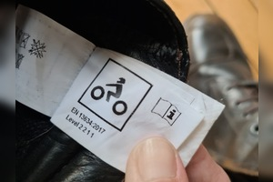
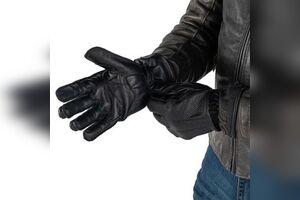
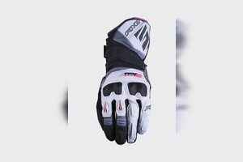

_(This post was automatically translated with [www.DeepL.com/Translator](http://www.DeepL.com/Translator))_

I describe in this article 4 methods to fill the empty areas of an image when enlarging it, a basic technique, and 3 based on the initial image, for a more natural filling.
At the end of the article, I give a shell script to generate the 4 versions for a given image.

<!--more-->

> _Edit of 04/22/2023: Added the fill with the initial background color._

## Method 1: Fill empty areas with a solid background

### Simple: Fixed background color (white)

```sh
convert IMAGESOURCE -trim -fuzz 5% +repage -auto-orient -resize XxY -background white -gravity center -extent XxY IMAGECIBLE
```

NB:_ Replace XxY with the desired dimensions and "_white_" with the desired color.

Example:


### Advanced: Background color taken from the first pixel at the top left of the original image

```sh
convert IMAGESOURCE -gravity northwest -crop 1x1+0+0 -format "%[pixel:u]" info:- | xargs -I {} convert IMAGESOURCE -resize XxY -background {} -gravity center -extent XxY IMAGECIBLE
```

Example:


## Method 2: Fill in the blanks by superimposing the image on its blurred and distorted version

Inspiration: 

> _Fred/fmw42_ in this forum page: [ImageMagick - Keep Aspect Ratio on Resize and Fill with Blur Background](https://legacy.imagemagick.org/discourse-server/viewtopic.php?t=28035).

```sh
convert IMAGESOURCE \( -clone 0 -blur 0x9 -resize XxY! \) \( -clone 0 -resize XxY \) -delete 0 -gravity center -compose over -composite IMAGECIBLE
```

NB :_ Replace XxY by the desired dimensions.


Example:

    
                                        


## Method 3: Fill in the empty areas by extrapolation

Inspiration: 

> _Fred/fmw42_ in this forum page: [ImageMagick - turn image with borders into full bleed image](https://legacy.imagemagick.org/discourse-server/viewtopic.php?t=26928).

The code is a bit long, I don't put it here, it is in the _shell_ script below.

The result is quite impressive on the pictures, especially if the dimensions are not too far from the original:
Sometimes you have to look closely at the extrapolated areas to realize that they are artificial (here in 300x300).

On the other hand, large flat areas of white do not suit him and stand out in red.

Example :

                                            


## Shell script

This shell script takes all the files in the subdirectory _"a_traiter/"_ and produces the results according to the 3 modes in the directory _"res/"_ .

- Mode 11 : Flat white ;
- Mode 12 : Solid background color ;
- Mode 2 : Extension ;
- Mode 4: Voronoi.

Set up:

```sh
mkdir gen_thumbs
cd gen_thumbs
mkdir a_traiter res
touch gen_thumbs.sh
chmod +x gen_thumbs.sh
```

Edit the file _"gen_thumbs.sh"_ and put :

```sh
#!/bin/bash

for fic in a_traiter/*
do
	echo ${fic}
	ficsource=$(basename "${fic}")
	xcible=300
	ycible=200
	size=${xcible}x${ycible}
	convert "${fic}" -resize ${size} res/tmp.png 

	xoff=`convert res/tmp.png -format "%w" info:`
	yoff=`convert res/tmp.png -format "%h" info:`
	yoff=$(((${ycible}-${yoff})/2))
	xoff=$(((${xcible}-${xoff})/2))
	vcoords="${size}-${xoff}-${yoff}"
	echo ${vcoords}

    # Mode 11 - fond blanc
	convert "${fic}" -trim -fuzz 5% +repage -auto-orient -resize ${xcible}x${ycible} -background white -gravity center -extent ${xcible}x${ycible} res/"${ficsource}".mode11.jpg

    # Mode 12 - fond repris de l'original
	convert "${fic}" -gravity northwest -crop 1x1+0+0 -format "%[pixel:u]" info:- | xargs -I {} convert "${fic}" -trim -fuzz 5% +repage -auto-orient -resize ${xcible}x${ycible} -background {} -gravity center -extent ${xcible}x${ycible} res/"${ficsource}".mode12.jpg

    # Mode 2 - superposition
	convert "${fic}" \( -clone 0 -blur 0x9 -resize ${xcible}x${ycible}\! \) \( -clone 0 -resize ${xcible}x${ycible} \) -delete 0 -gravity center -compose over -composite res/"${ficsource}".mode2.jpg

	# Mode 3 - superposition
	convert res/tmp.png -transparent white +repage \( -clone 0 -alpha off -sparse-color Voronoi \
	"9,9 rgb(255,8,8)  969,9 rgb(255,255,8)  969,669 rgb(255,255,248)  9,669 rgb(255,248,248)" \) \
	+swap -compose over -composite \
	-define distort:viewport=${size}-${xoff}-${yoff} +distort SRT 0 +repage res/"${ficsource}".mode3.jpg
	rm -f res/tmp.png
done
```

All you have to do is put an image in the _"a_traiter/"_ directory and run the script:

```sh
cd gen_thumb_sparse_voronoi/
./gen_thumb_sparse_voronoi.sh
```

The result will be produced in _"res/"_.

> Note: To change the target dimensions, just change the values of xcible=xxx and ycible=yyy.


