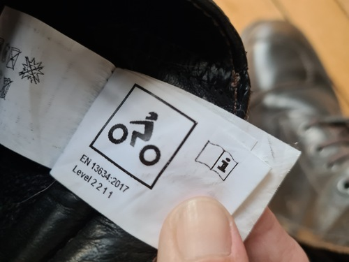

_(This post was automatically translated -with some manual corrections- with [www.DeepL.com/Translator](http://www.DeepL.com/Translator))_

A short post to give the features of the Rocket boots from Stylmartin because I realized that they were very hard to find on the internet.

<!--more-->

Pictogram:

In summary:

- Shank height: Level 2 (high)[^1]
- Abrasion resistance: Level 2 (12 s zone B, 2.5 s zone A)
- Puncture resistance: Level 1
- Lateral stiffness: Level 1

For the record, I've owned these boots for 2 years and I'm very happy with them: they ride high, they are waterproof and well built (thick but comfortable leather, laces adjustment protected by a leather band, side zip opening, etc.), the soles grip surprisingly well, and they age well, as shown in the picture above.

I simply maintain them from time to time with _Saphir Universal Cream_ (ex. [at _Valmour_](https://www.valmour.fr/cirage-creme-universelle-saphir.html)).

[^1]: Standard _CE EN 13634-2017_ :

    1. **Height of the front/rear calf shaft** :  
    Measured from the ground ([source: CE Standards](https://standards.iteh.ai/catalog/standards/cen/f5bbe4a8-39ee-4652-96a3-cc060d0b8236/en-13634-2017)) :
        1. Level 1: 10.3 cm/6.4 cm below 36, up to 12.1 cm/7.3 cm above 45.
        2. Level 2: 16.2 cm/11.3 cm below 36, up to 19.2 cm / 13.1 cm above 45.
    2. **Abrasion**:  
       Number of seconds to cross upper+lining with a 60 grit abrasive belt running at 8 m/s (zone B = high risk, zone A = rest of shoe) ([source: _Motoservice_](https://www.motoservices.com/dossiers-accessoire-moto-equipement-moto/equipement-moto-scooter-les-normes-en-vigueur-fev-2019.htm)):
        1. Level 1: 1.5 s zone A, 5 s zone B
        2. Level 2: 2,5 s zone A, 12 s zone B
    3. **Perforation/Cutting**:  
       A blade is thrown at 2.8 m/s on rod+liner and penetration is measured ([source: _Tcxboots_](https://fr.tcxboots.com/pages/certifications)):
        1. Level 1: < 25 mm
        2. Level 2: < 15 mm
    4. **Stiffness**:  
       Measure of the force required to deform the sole by 2 cm ([source: _Tcxboots_](https://fr.tcxboots.com/pages/certifications)):
        1. Level 1: > 1 kN
        2. Level 2: > 1.5 kN

