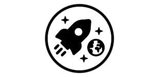

_(This post was automatically translated with [www.DeepL.com/Translator](http://www.DeepL.com/Translator))_

Below I list a series of Imagemagick commands to generate all the favicon variants that a website can offer to browsers, from a good quality original.

I indicate at the end of the article the 2 conf files to update, as well as a modification of the Hugo theme, which will be useful for all browsers to find their little ones.

<!--more-->

## Original image

I bought a nice icon on the very good website [The Noun Project](https://thenounproject.com/) : [Space drawn by Adrien Coquet](https://thenounproject.com/term/space/2217279/). 

I modified it in _Inkscape_ to add a border, then I put it in _./static/favicons/_, as well as a 1024x1024 PNG version "_logo_large.png_".


### Generating variants

Variants recommended by [The 2020 Guide to FavIcons for Nearly Everyone and Every Browser](https://www.emergeinteractive.com/insights/detail/the-essentials-of-favicons/), [favicon-cheat-sheet](https://github.com/audreyfeldroy/favicon-cheat-sheet) and [https://realfavicongenerator.net](https://realfavicongenerator.net).

The configuration of the unsharp command comes from the doc [Imagemagick Resize or Scaling](https://legacy.imagemagick.org/Usage/resize/), it is the one applied by the GIMP software.

```sh
mkdir -p ./static/favicons/

#favicon-16x16.png
convert ./static/logos/logo_large.png -resize 16x16 -unsharp 0x6+0.5+0 ./static/favicons/favicon-16x16.png
#favicon-32x32.png
convert ./static/logos/logo_large.png -resize 32x32 -unsharp 0x6+0.5+0 ./static/favicons/favicon-32x32.png
#favicon-48x48.png
convert ./static/logos/logo_large.png -resize 48x48 -unsharp 0x6+0.5+0 ./static/favicons/favicon-48x48.png
#favicon-128x128.png
convert ./static/logos/logo_large.png -resize 128x128 -unsharp 0x6+0.5+0 ./static/favicons/favicon-128x128.png
#favicon-152x152.png
convert ./static/logos/logo_large.png -resize 152x152 -unsharp 0x6+0.5+0 ./static/favicons/favicon-152x152.png
#favicon-167x167.png
convert ./static/logos/logo_large.png -resize 167x167 -unsharp 0x6+0.5+0 ./static/favicons/favicon-167x167.png
#favicon-180x180.png
convert ./static/logos/logo_large.png -resize 180x180 -unsharp 0x6+0.5+0 ./static/favicons/favicon-180x180.png
#favicon-192x192.png
convert ./static/logos/logo_large.png -resize 192x192 -unsharp 0x6+0.5+0 ./static/favicons/favicon-192x192.png
#favicon-196x196.png
convert ./static/logos/logo_large.png -resize 196x196 -unsharp 0x6+0.5+0 ./static/favicons/favicon-196x196.png
#favicon-256x256.png
convert ./static/logos/logo_large.png -resize 256x256 -unsharp 0x6+0.5+0 ./static/favicons/favicon-256x256.png
#favicon-512x512.png
convert ./static/logos/logo_large.png -resize 512x512 -unsharp 0x6+0.5+0 ./static/favicons/favicon-512x512.png
```


The favicon in the "_.ico_" format combines 3 formats, 16x16, 32x32 and 48x48 in one container:

```sh
#favicon.ico
convert ./static/favicons/favicon-16x16.png ./static/favicons/favicon-32x32.png ./static/favicons/favicon-48x48.png ./static/favicon.ico
```

Browser specific favicons :

```sh
#mstiles 70x70
convert ./static/logos/logo_large.png -resize 70x70 -unsharp 0x6+0.5+0 ./static/favicons/mstiles-70x70.png
#mstiles 144x144
convert ./static/logos/logo_large.png -resize 144x144 -unsharp 0x6+0.5+0 ./static/favicons/mstiles-144x144.png
#mstiles 150x150
convert ./static/logos/logo_large.png -resize 150x150 -unsharp 0x6+0.5+0 ./static/favicons/mstiles-150x150.png
#mstiles 310x150
convert ./static/logos/logo_large.png -resize 150x150 -unsharp 0x6+0.5+0  -background transparent -gravity center -extent 310x150 ./static/favicons/mstiles-310x150.png
#mstiles 310x310
convert ./static/logos/logo_large.png -resize 310x310 -unsharp 0x6+0.5+0 ./static/favicons/mstiles-310x310.png
```





### File ieconfig.xml

I put it in the root.

```xml
<?xml version="1.0" encoding="utf-8"?>
    <browserconfig>
      <msapplication>
        <tile>
          <square70x70logo src="favicons/mstiles-70x70.png"/>
          <square144x144logo src="favicons/mstiles-144x144.png"/>
          <square150x150logo src="favicons/mstiles-150x150.png"/>
          <wide310x150logo src="favicons/mstiles-310x150.png"/>
          <square310x310logo src="favicons/mstiles-310x310.png"/>
          <TileColor>#FFFFFF</TileColor>
        </tile>
      </msapplication>
    </browserconfig>
```

### Webmanifest file

I put it in the root.

```json
{
    "name": "Lobotourisme",
    "short_name": "Lobotourisme",
    "icons": [
        {
            "src": "favicons/favicon-192x192.png",
            "sizes": "192x192",
            "type": "image/png"
        },
        {
            "src": "favicons/favicon-256x256.png",
            "sizes": "256x256",
            "type": "image/png"
        },
        {
            "src": "favicons/favicon-512x512.png",
            "sizes": "512x512",
            "type": "image/png"
        }
    ],
    "theme_color": "#ffffff",
    "background_color": "#ffffff",
    "display": "standalone"
}

```


### Modification of the Hugo theme so that it uses all our favicon variants

Find the _layout_ that lists favicons and add :

```html
  <link rel="icon" href='{{ "favicons/favicon.png" | relURL }}'>
  <link rel="icon" type="image/png" sizes="16x16" href='{{ "favicons/favicon-16x16.png" | relURL }}'>
  <link rel="icon" type="image/png" sizes="32x32" href='{{ "favicons/favicon-32x32.png" | relURL }}'>
  <link rel="icon" type="image/png" sizes="128x128" href='{{ "favicons/favicon-128x128.png" | relURL }}'>
  <link rel="icon" type="image/png" sizes="152x152" href='{{ "favicons/favicon-152x152.png" | relURL }}'>
  <link rel="icon" type="image/png" sizes="167x167" href='{{ "favicons/favicon-167x167.png" | relURL }}'>
  <link rel="icon" type="image/png" sizes="180x180" href='{{ "favicons/favicon-180x180.png" | relURL }}'>
  <link rel="icon" type="image/png" sizes="192x192" href='{{ "favicons/favicon-192x192.png" | relURL }}'>
  <link rel="icon" type="image/png" sizes="196x196" href='{{ "favicons/favicon-196x196.png" | relURL }}'>
  <!--[if IE]><link rel="shortcut icon" href='favicon.ico'><![endif]-->
  <link rel="apple-touch-icon-precomposed" href='{{ "favicons/favicon-180x180.png" | relURL }}'>
  <link rel="apple-touch-icon" sizes="180x180" href='{{ "favicons/favicon-180x180.png" | relURL }}'>
  <link rel="shortcut icon" sizes="196x196" href='{{ "favicons/favicon-196x196.png" | relURL }}'>
  <meta name="msapplication-TileColor" content="#FFFFFF">
  <meta name="msapplication-TileImage" content='{{ "favicons/favicon-144x144.png" | relURL }}'>
  <link rel="mask-icon" content='{{ "logos/logo_large.svg" | relURL }}' color="#000000">
  <meta name="application-name" content="Lobotourisme">
  <meta name="msapplication-tooltip" content="Tooltip">
  <meta name="msapplication-config" content='{{ "ieconfig.xml" | relURL }}'>
```

### To check that everything is there:

Go to [https://realfavicongenerator.net/favicon_checker](https://realfavicongenerator.net/favicon_checker) to test that everything is available.

