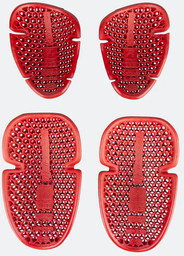
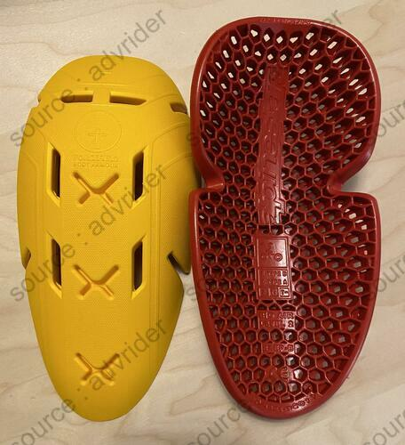
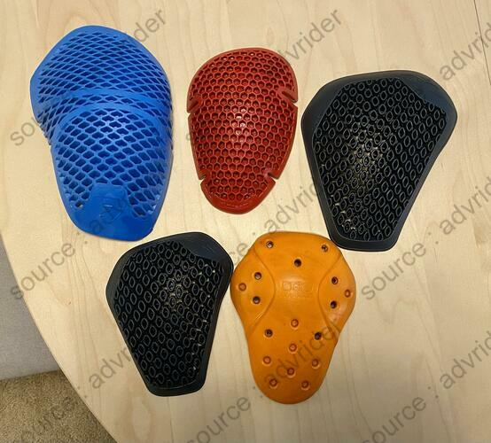

_(This post was automatically translated with [www.DeepL.com/Translator](http://www.DeepL.com/Translator))_

This sheet summarizes the information I was able to glean on the net about the _Alpinestars Bio Air_ level 2 protective shells.

<!--more-->

_Synthesis:_ Very good protection (25% above standard), very good ventilation, and reasonable price.

Marketing:
-------------------

Sold in complete kit shoulders + elbows, around 33e :

- Kit in size B :
    - Elbow B/knee A : Dimensions and weight not found
    - Shoulder B : Dimensions and weight not found
- Kit in size A :
    - Elbow A: Dimensions and weight not found
    - Shoulder A: Dimensions and weight not found

Quite easy to find on the net (pay attention to the size A or B: If they fit in your clothes it is better to prefer the B sizes, which are bigger).

Characteristics of the shells :
-----------------------------

- Certification : Level 2 T+ T- [^1]
- Actual protection: The manufacturer announces < 16 kN
- Other statement: MotoCAP tests (Australian independent tester) would have noted an average of about 13 kN and a maximum of 17 kN (standard: 20 kN on average, maximum 30 kN) [^2] 
- Manufacturing: Italy
- Advertised durability: ?
- Type of materials : Rigid vulcanized materials
- Ventilation : Very good

Comfort and comparison with other brands : 
------------------------------------------------

My opinion:
The material being rigid, one can imagine that the hulls follow the movements less than the viscoelastic ones used by SAS-TEC, BMW, etc.

On the other hand, the ventilation is obviously superior to all the competitors of level 2 (approaching: REV'IT Seeflex).

For less ventilated but more protective (<12 kN), more covering and at a similar price, it is interesting to look at SAS-TEC:
[My article on SAS-TEC SC1/EVO1, EVO2 and EVO3]()

Photos :
--------

### General photos:

Kit size B :

Kit size A :

Level 2 T+ T- : 

### Comparisons:

These photos are from the conversation [advrider.com: CE2 Replacement Armor Database / Comparison](https://advrider.com/f/threads/ce2-replacement-armor-database-comparison.1466522/).

#### Forcefield Isolator 2:

#### Rev'It Seeflex & Alpinestars Nucleon Flex Pro & D3O :

Readings:
----------

- [advrider.com: CE2 Replacement Armor Database / Comparison](https://advrider.com/f/threads/ce2-replacement-armor-database-comparison.1466522/)

[^1]: CE EN 1621-1 standard (shoulder, hip and limb protection) : A 5 kg weight is dropped with a force of 50 joules on the part, 9 times. 
Level 1 : Average <35 kN. No shock exceeds 50 kN. 
Level 2 : Average <20 kN. No shock exceeds 30 kN. 
T+ : The protection remains the same up to 40°C. 
T-: Protection remains the same down to -10°C.

[^2]: Source : _cblais19_ in [advrider.com : CE2 Replacement Armor Database / Comparison](https://advrider.com/f/threads/ce2-replacement-armor-database-comparison.1466522/)