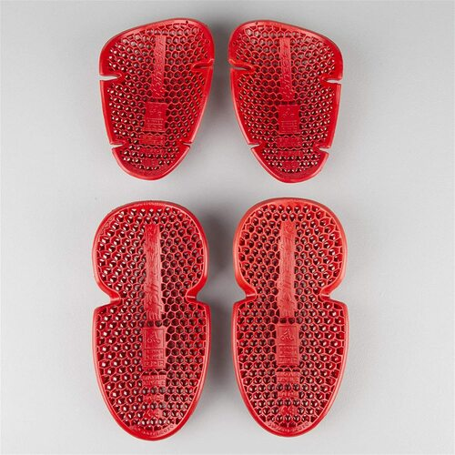
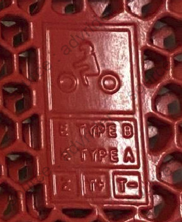
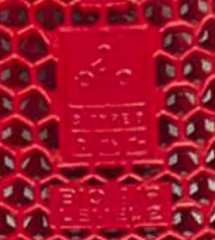
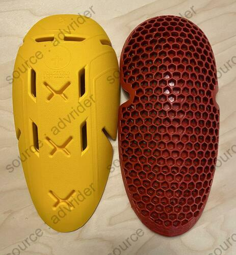

Cette fiche récapitule les informations que j'ai pu glaner sur le net sur les coques de protection _Alpinestars Bio Air_ de niveau 2.

<!--more-->

_Synthèse :_ Protection très bonne (25% au dessus de la norme), aération très bonne, et tarif raisonnable.

Commercialisation :
-------------------

Vendues en kit complets épaules + coudes, autours de 33e :

- Kit en taille B :
    - Coude B/genou A : Dimensions et poids non trouvés
    - Epaule B : Dimensions et poids non trouvés
- Kit en taille A :
    - Coude A : Dimensions et poids non trouvés
    - Epaule A : Dimensions et poids non trouvés

Assez faciles à trouver sur le net (attention à la taille A ou B : Si elles rentrent dans vos vêtements il vaut mieux privilégier les tailles B, qui sont plus grandes).

Caractéristiques des coques :
-----------------------------

- Certification : Niveau 2 T+ T- [^1]
- Protection réelle : Le fabricant annonce < 16 kN
- Autre relevé : Les tests MotoCAP (testeur indépendant Australien) auraient relevé une moyenne d'environ 13 kN et un maximum de 17 kN (norme : 20 kN en moyenne, maximum 30 kN).[^2] 
- Fabrication : Italie
- Longévité annoncée : ?
- Type de matériaux : Matériaux vulcanisé rigide
- Aération : Très bonne

Confort et comparaison avec les autres marques : 
------------------------------------------------

Mon avis :
Le matériaux étant rigide, on peut imaginer que les coques suivent moins les mouvements que les visco-élastiques qu'emploient SAS-TEC, BMW, etc.

En revanche l'aération est manifestement supérieure à tous les concurrents de niveau 2 (approchant : REV'IT Seeflex).

Pour des protections moins aérées mais plus protectrices (<12 kN), plus couvrantes et à un prix similaire, il est intéressant de regarder du côté de SAS-TEC :
[Mon article sur les SAS-TEC SC1/EVO1, EVO2 et EVO3]()

Photos :
--------

### Photos générales :

Kit taille B :

Kit taille A :

Niveau 2 T+ T- : 

### Comparaisons :

Ces photos proviennent de la conversation [advrider.com : CE2 Replacement Armor Database / Comparison](https://advrider.com/f/threads/ce2-replacement-armor-database-comparison.1466522/).

#### Forcefield Isolator 2 :

#### Rev'It Seeflex & Alpinestars Nucleon Flex Pro & D3O :

Lectures :
----------

- [advrider.com : CE2 Replacement Armor Database / Comparison](https://advrider.com/f/threads/ce2-replacement-armor-database-comparison.1466522/)

[^1]: Norme CE EN 1621-1 (protections épaules, hanches, membres) : Un poids de 5 kg est lâché avec une force de 50 joules sur la pièce, 9 fois. 
Niveau 1 : Moyenne <35 kN. Aucun choc ne dépasse 50 kN. 
Niveau 2 : Moyenne <20 kN. Aucun choc ne dépasse 30 kN. 
T+ : La protection reste la même jusqu'à 40°C. 
T- : La protection reste la même jusqu'à -10°C.

[^2]: Source : _cblais19_ dans [advrider.com : CE2 Replacement Armor Database / Comparison](https://advrider.com/f/threads/ce2-replacement-armor-database-comparison.1466522/)