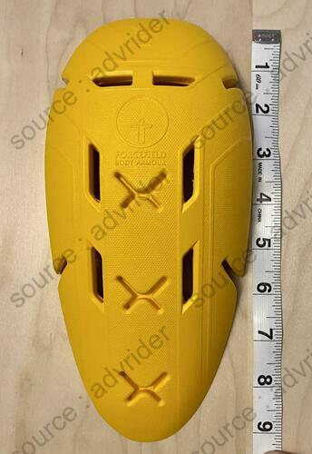
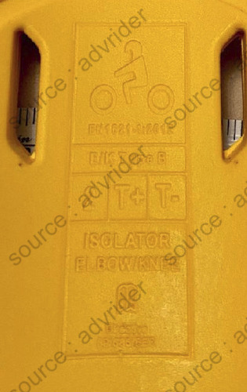
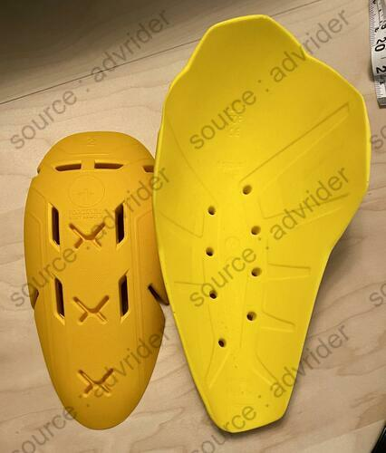
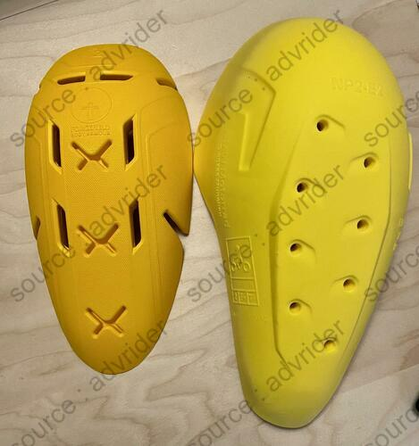
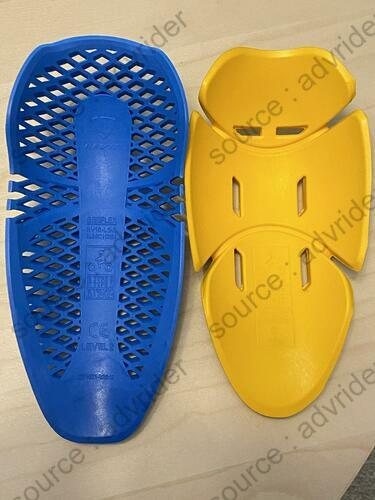
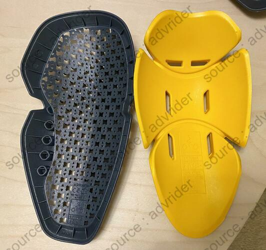

+++
title = "Protections moto Forcefield Isolator 2"
date = "2021-04-24"
categories = ["protections moto"]
tags = ["Forcefield Isolator 2", "protection moto genoux", "protection moto coudes", "protection moto hanches", "protection moto épaules"]
+++

Synthèse :
----------

4 modèles :
- Genou B ("K B") : 24 cm x 16.5 cm - 114 g
- Hanche B ("H B") : 23 cm x 11.5 cm - 80 g
- Coude B/genou B ("E/K B") : 24.5 cm x 16 cm - 114 g
- Epaule B ("S B") : 20.5 cm x 15 cm - 96 g

Caractéristiques :

- Certification : Niveau 2 T+ T- [^1]
- Protection réelle : Le fabricant annonce un minimum de 10,6kN => donc entre 10,6 kN et 30 kN (norme : 20 kN en moyenne, maximum 30 kN)
- Fabrication : Royaume-Uni
- Longévité annoncée : 2 à 3 ans
- Type de matériaux : Visco-élastique souple (> D3O), s'ajuste avec la chaleur corporelle
- Aération:	Bonne
- Prix :Environ 30e par paire

Confort et comparaison avec les autres marques : 
------------------------------------------------

Synthèse (détails plus bas) :

(-) Forcefield Isolator L2| (+) Knox Microlock L2
--------------------------|--------------------
Aération | Couverture + ajustement + souplesse par temps froid

(+) Forcefield Isolator L2         | (-) D3O 
-----------------------------------|--------------------
Ajustement + souplesse + protection| N/A (prix ?)

### Température :

> "pads do go very stiff in cold temperatures and take a while to soften"
> — <cite>advrider cblais19</cite>

### Comparaison avec les Knox Micro-lock L2, SAS-Tec et D3O :

> The softest high protection (CE2) armor I've found is the Knox MicroLock. It's more pliable then Forcefield, SasTec, or D3O; and has a softer feel when joint pressure is applied. 
> — <cite>[advrider cblais19](https://advrider.com/f/threads/comfortable-knee-armor.1371777/#post-37833963)</cite>

### Comparaison avec le D3O :

> "Compared to D3O’s [T5 EVO Pro X armor](https://www.mcgearhub.com/motorcycle-armor/d3o-knee-elbow-armor-review-t5-evo-pro-x/) (which is also CE-certified as Level 2), the Forcefield Isolator 2 armor is signicantly more contouring, wrapping and compliant."
> — <cite>[mcgearhub.com](https://www.mcgearhub.com/motorcycle-armor/forcefield-isolator-2-armor-review-all-pads/)</cite>

> "And Brian Van also said: "Forcefield is better [than D30] for sure. D3O is a nice low profile armor that helps to reduce bulk and increase comfort. You will find the Forcefield to be thicker as compared to the D3O which I feel is necessary to provide a higher level of protection."
> — <cite>[advrider Valentino](https://advrider.com/f/threads/ce2-replacement-armor-database-comparison.1466522/page-4#post-40897652)</cite>

### Comparaison avec les Knox Micro-lock L2 :

> ++ for Microlock. I've tried all the molecular/soft armors and the Knox is by far the most compliant at all temps. Forcefield Isolator is also good, but has a stiffer matrix at all times. I've got a bunch of Isolator CE2 pads that I'm actually replacing with Microlock due to the comfort difference.
> — <cite>[advrider cblais19](https://advrider.com/f/threads/comfortable-knee-armor.1371777/#post-37211909)</cite>

> Knox Microlock has much larger coverage for the elbow/knee armors (wash on the shoulders) - and a compound that is softer to the touch. Forcefield has larger vent holes [...]. I also find that Forcefield takes longer to warm up in cool temps, and is extremely stiff until the - both are rated as temp stable however.
> — <cite>[advrider cblais19](https://advrider.com/f/threads/would-like-recommendations-for-cool-armored-gear.1389835/#post-37841358)</cite>

Photos :
--------

Note : La plupart des photos viennent de la conversation [advrider.com : CE2 Replacement Armor Database / Comparison](https://advrider.com/f/threads/ce2-replacement-armor-database-comparison.1466522/) ou de [mcgearhub.com : FORCEFIELD ISOLATOR 2 ARMOR REVIEW (ALL PADS)](https://www.mcgearhub.com/motorcycle-armor/forcefield-isolator-2-armor-review-all-pads/).

### Fiches constructeur :

### Photos générales :

Face, dos et notations (source : [advrider]((https://advrider.com/f/threads/ce2-replacement-armor-database-comparison.1466522/))) :

### Comparaisons :

#### Alpinestar Bio Armor Air :

#### BMW NP2 :

#### Rev'It Seeflex :

#### Knox Micro-lock  :

#### Alpinesars Nucleon Flex Pro :

Lectures :
----------

- [mcgearhub.com : FORCEFIELD ISOLATOR 2 ARMOR REVIEW (ALL PADS)](https://www.mcgearhub.com/motorcycle-armor/forcefield-isolator-2-armor-review-all-pads/)
- [advrider.com : CE2 Replacement Armor Database / Comparison](https://advrider.com/f/threads/ce2-replacement-armor-database-comparison.1466522/)

[^1]: Norme CE EN 1621-1 (protections épaules, hanches, membres) : Un poids de 5 kg est lâché avec une force de 50 joules sur la pièce, 9 fois. 
Niveau 1 : Moyenne <35 kN. Aucun choc ne dépasse 50 kN. 
Niveau 2 : Moyenne <20 kN. Aucun choc ne dépasse 30 kN. 
T+ : La protection reste la même jusqu'à 40°C. 
T- : La protection reste la même jusqu'à -10°C.