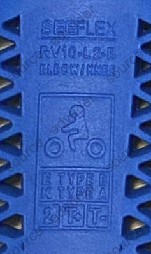
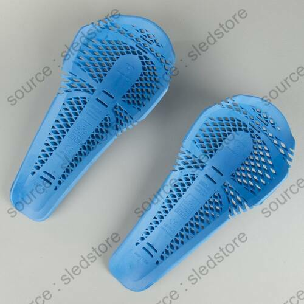

_(This post was automatically translated with [www.DeepL.com/Translator](http://www.DeepL.com/Translator))_

This sheet summarizes the information I was able to glean from the net about the _Rev'It Seeflex_ level 2 protective shells.

<!--more-->

_Summary:_ Great coverage, excellent ventilation, high price, protection just at the standard.

Marketing:
-------------------

7 models are available for sale (30 to 50€ per pair), all are level 2:

- RV10 (Elbow B/knee B)
    - Dimensions : 25,3 cm x 11,3 cm x 7,5 cm
    - Weight : ? g
- RV11 (Shoulder B - large size) :
    - Dimensions: 22.4 cm x 16.8 cm x 10 cm
    - Weight : ? g
- RV12 (Knee B/leg B)
    - Dimensions : **34.7 cm** x 13 cm x 9 cm
    - Weight: ? g
- RV13 (Shoulder B - standard size)
    - Dimensions: 19.6 cm x 12.8 cm x 5.5 cm
    - Weight : ? g
- RV14 (Knee B)
    - Dimensions: 26 cm x 12.5 cm x 6.9 cm
    - Weight : ? g
- RV15 (Elbow A)
    - Dimensions: 22.8 cm x 12.5 cm x 6.9 cm
    - Weight : ? g
- RV16 (Shoulder A)
    - Dimensions: 16.7 cm x 11.3 cm x 5.6 cm
    - Weight : ? g

Findable everywhere on the net.

Characteristics of the shells :
-----------------------------

- Certification: Level 2 T+ T- [^1]
- Actual protection: The manufacturer does not give a figure. MotoCAP would have (source: [advrider](https://advrider.com/f/threads/ce2-replacement-armor-database-comparison.1466522/)) measured an average of 18,9 kN for the elbow (standard: 20 kN on average, maximum 30 kN)
- Manufacturing: ?
- Advertised life span: ?
- Type of materials: Rigid vulcanized materials, does not adjust with body heat
- Ventilation : Very good

Comfort and comparison with other brands : 
------------------------------------------------

My opinion:
Their main appeal is the combination of great coverage and great ventilation. Other than that the protection is a bit low, and the reviews below say they are not very comfortable.

For less ventilated but more protective (<12 kN), even more covering and half the price, it is interesting to look at SAS-TEC :

- Knees/elbows very large size: [My article on SAS-TEC SC1/06EVO]()
- Shoulders, knees, elbows large size : [My article on SAS-TEC SC1/EVO1, EVO2 and EVO3]()

And for shoulder and elbow protections that are just as airy, more protective (< 16 kN), a little less covering and half the price too, there are the Alpinestar Bio Air : 

- Shoulders and elbows: [My article on Alpinestar Bio Air]()

### Feedback: Stiffness and unpleasant angles:

> Seeflex is relatively stiff so if you're used to d3O stuff (what Rukka uses), the Seeflex may feel like a brick although d3O isn't exactly the least stiffest of all armor.
> — <cite>[advrider ThrillSeeka](https://advrider.com/f/threads/armor-upgrade-for-rukka.1464303/#post-40753844)

### Feedback: 

> Rev'it's choice of thin square edges for the molds can cause discomfort if pressed against tissue for prolonged periods - frequently cited in Revzilla reviews for the knee in particular
> — <cite>[advrider cblais19](https://advrider.com/f/threads/ce2-replacement-armor-database-comparison.1466522/page-4#post-40913774)</cite>

### Feedback: Comparison with Alpinestars Nucleon Air and Forcefield Isolator 2:

> Material is a hard rubbery compound similar to A* Nucleon Air, but has a slight bit more give to it when pressed hard. The shape is slightly larger then the coverage offered by the Forcefield protector, but that's mainly due to a longer and very thin end piece. 
> — <cite>[advrider cblais19](https://advrider.com/f/threads/ce2-replacement-armor-database-comparison.1466522/page-4#post-40913774)</cite>
> 
### Feedback: Special shape of the shoulder protectors:

> Shoulder protectors from this line are among the most asymmetrical out there with wide scapula coverage, and are unlikely to fit most standard pockets.
> — <cite>[advrider cblais19](https://advrider.com/f/threads/ce2-replacement-armor-database-comparison.1466522/page-4#post-40913774)</cite>
> 
### Feedback: Compatibility with Dainese clothing:

> An inmate reports that the elbow protectors are a perfect replacement for the Dainese hardshell/foam CE1 protectors.
> — <cite>[advrider cblais19](https://advrider.com/f/threads/ce2-replacement-armor-database-comparison.1466522/page-4#post-40913774)</cite>

Photos :
--------

Note: Most of the pictures are from the conversation [advrider.com: CE2 Replacement Armor Database / Comparison](https://advrider.com/f/threads/ce2-replacement-armor-database-comparison.1466522/).

### Manufacturer's data sheets :

### General photos :

Elbow/knee marking (RV10) (source: advrider):

Knee/leg (RV12):

Shoulders B (RV13) and elbows/knee B (RV10) :

### Comparisons:

#### Forcefield Isolator 2:

#### Alpinestars Bio Air & Alpinestars Nucleon Flex Pro & D3O :

Readings :
----------

- [RWN sur Youtube - Revit Seeflex Protektoren](https://www.youtube.com/watch?v=mAOMe18tnsU)
- [advrider.com : CE2 Replacement Armor Database / Comparison](https://advrider.com/f/threads/ce2-replacement-armor-database-comparison.1466522/)

[^1]: CE EN 1621-1 standard (shoulder, hip and limb protection) : A 5 kg weight is dropped with a force of 50 joules on the part, 9 times. 
Level 1 : Average <35 kN. No shock exceeds 50 kN. 
Level 2 : Average <20 kN. No shock exceeds 30 kN. 
T+ : The protection remains the same up to 40°C. 
T-: Protection remains the same down to -10°C.
