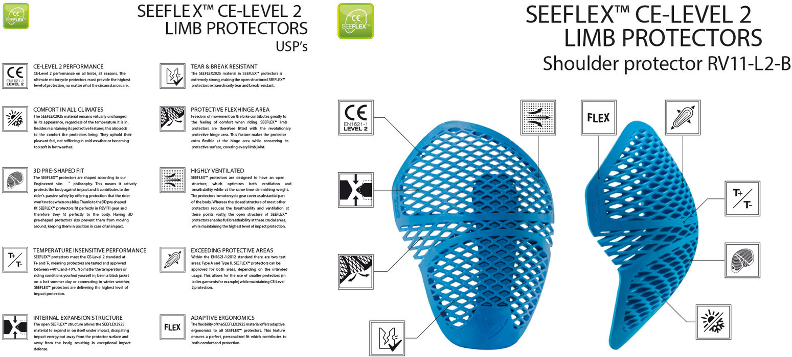
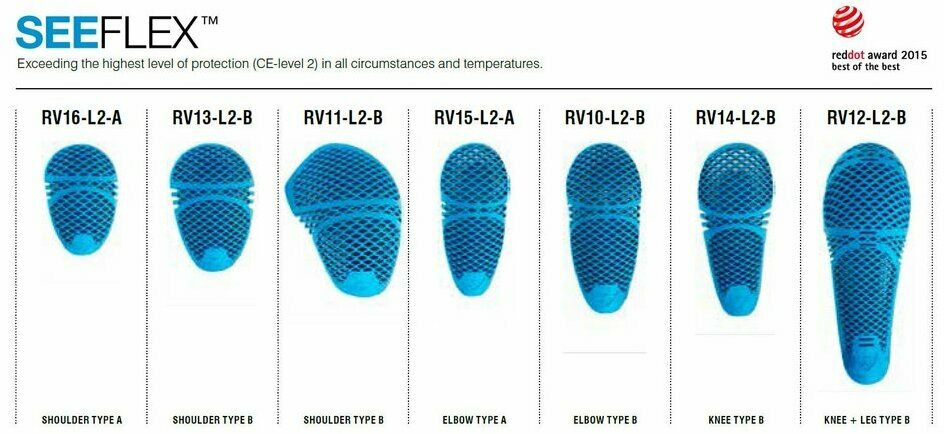

+++
title = "Protections moto Rev'it Seeflex"
date = "2021-04-26"
categories = ["protections moto", "protection moto genoux", "protection moto coudes", "protection moto épaules", "protection moto jambes"]
tags = ["REV'IT", "REV'IT SEEFLEX"]
+++

Synthèse :
----------

7 modèles :

- RV10 - Coude B/genou B (E B/K B) : ? cm x ? cm - ? g
- RV11 - Epaule B (S B) : ? cm x ? cm - ? g
- RV12 - Genou B/jambe B (K B/L B) : ? cm x ? cm - ? g
- RV13 - Epaule B (S B) : ? cm x ? cm - ? g
- RV14 - Genou B (K B) : ? cm x ? cm - ? g
- RV15 - Coude A (E A) : ? cm x ? cm - ? g
- RV16 - Epaule A (S A) : ? cm x ? cm - ? g

Caractéristiques :

- Certification : Niveau 2 T+ T- [^1]
- Protection réelle : Le fabricant ne donne pas de chiffre. MotoCAP aurait (source : advrider) mesuré une moyenne de 18,9 kN pour le coude (norme : 20 kN en moyenne, maximum 30 kN)
- Fabrication : ?
- Longévité annoncée : ?
- Type de matériaux : Matériaux vulcanisé rigide, ne s'ajuste pas avec la chaleur corporelle
- Aération : Très bonne
- Prix : Environ 30e par paire

Confort et comparaison avec les autres marques : 
------------------------------------------------

> Seeflex is relatively stiff so if you're used to d3O stuff (what Rukka uses), the Seeflex may feel like a brick although d3O isn't exactly the least stiffest of all armor.
> — <cite>[advrider ThrillSeeka](https://advrider.com/f/threads/armor-upgrade-for-rukka.1464303/#post-40753844)

### Angles désagréables

> Rev'it's choice of thin square edges for the molds can cause discomfort if pressed against tissue for prolonged periods - frequently cited in Revzilla reviews for the knee in particular
> — <cite>[advrider cblais19](https://advrider.com/f/threads/ce2-replacement-armor-database-comparison.1466522/page-4#post-40913774)</cite>

### Comparaison avec les Alpinestars Nucleon Air et les Forcefield Isolator 2

> Material is a hard rubbery compound similar to A* Nucleon Air, but has a slight bit more give to it when pressed hard. The shape is slightly larger then the coverage offered by the Forcefield protector, but that's mainly due to a longer and very thin end piece. 
> — <cite>[advrider cblais19](https://advrider.com/f/threads/ce2-replacement-armor-database-comparison.1466522/page-4#post-40913774)</cite>
> 
### Forme particulière des protections d'épaules

> Shoulder protectors from this line are among the most asymmetrical out there with wide scapula coverage, and are unlikely to fit most standard pockets.
> — <cite>[advrider cblais19](https://advrider.com/f/threads/ce2-replacement-armor-database-comparison.1466522/page-4#post-40913774)</cite>
> 
### Compatibilité avec les vêtements Dainese :

> An inmate reports that the elbow protectors are a perfect replacement for the Dainese hardshell/foam CE1 protectors.
> — <cite>[advrider cblais19](https://advrider.com/f/threads/ce2-replacement-armor-database-comparison.1466522/page-4#post-40913774)</cite>

Photos :
--------

Note : La plupart des photos viennent de la conversation [advrider.com : CE2 Replacement Armor Database / Comparison](https://advrider.com/f/threads/ce2-replacement-armor-database-comparison.1466522/).

### Fiches constructeur :

### Photos générales :

### Comparaisons :

#### Forcefield Isolator 2 :

#### Alpinestars Bio Air & Alpinestars Nucleon Flex Pro & D3O :

Lectures :
----------

- [advrider.com : CE2 Replacement Armor Database / Comparison](https://advrider.com/f/threads/ce2-replacement-armor-database-comparison.1466522/)

[^1]: Norme CE EN 1621-1 (protections épaules, hanches, membres) : Un poids de 5 kg est lâché avec une force de 50 joules sur la pièce, 9 fois. 
Niveau 1 : Moyenne <35 kN. Aucun choc ne dépasse 50 kN. 
Niveau 2 : Moyenne <20 kN. Aucun choc ne dépasse 30 kN. 
T+ : La protection reste la même jusqu'à 40°C. 
T- : La protection reste la même jusqu'à -10°C.
