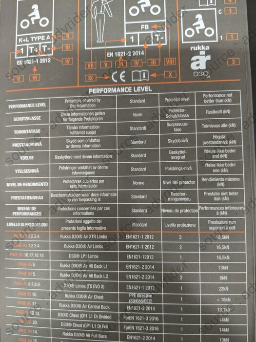
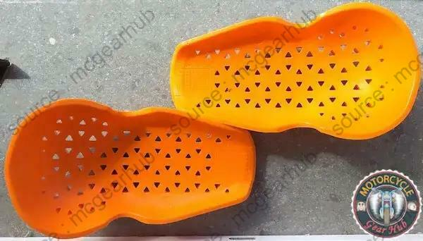
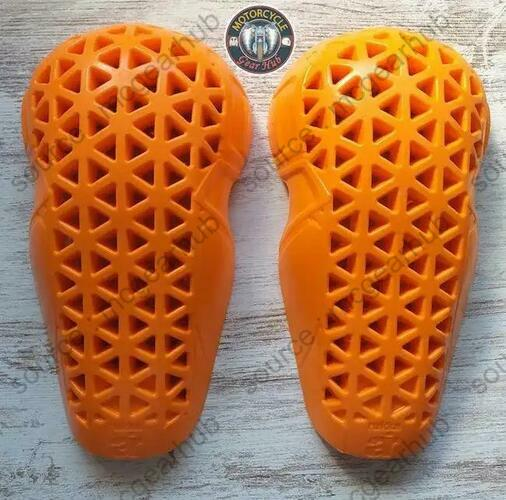
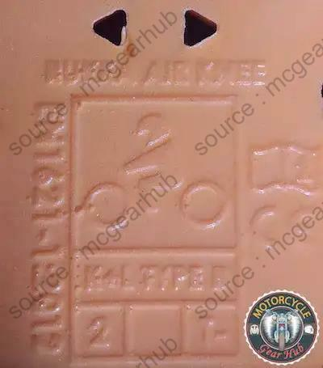
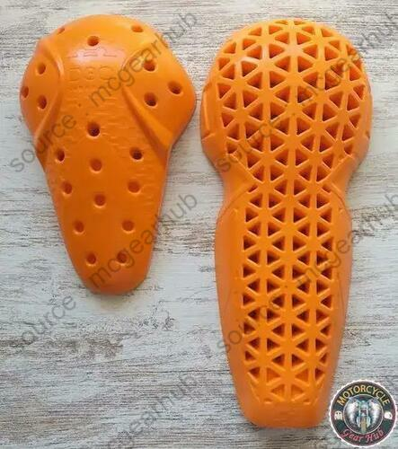

_(This post was automatically translated with [www.DeepL.com/Translator](http://www.DeepL.com/Translator))_

This sheet summarizes the information I was able to glean on the net about the _Rukka D3O Air XTR_ level 2 protective shells (limbs only, I don't look at the _D3O CP1/L1_ thorax which is level 1).

<!--more-->

_Synthesis:_ Flexible, great coverage, very good ventilation, high price.

Marketing:
-------------------

4 models in the series (expensive: 40 to 50e per pair), all level 2:

- Elbow B
    - Dimensions : 25 cm x 14 cm
    - Weight : ? g
- Hip B
    - Dimensions: 20 cm x 17 cm
    - Weight : ? g
- Shoulder B
    - Size : 23 cm x 19 cm
    - Weight : ? g
- Knee B/leg B 
    - Dimensions: 33 cm x 15 cm
    - Weight : ? g

Findable everywhere on the net.

Characteristics of the shells :
-----------------------------

- Certification : Level 2 T- (not certified T+) [^1]
- Actual protection: The manufacturer announces <16,5 kN (standard: 20 kN on average, maximum 30 kN)
- Manufacturing: China
- Advertised durability: ?
- Material type: D3O, flexible but does not adjust with body heat
- Ventilation : Very good

Comfort and comparison with other brands : 
------------------------------------------------

My opinion:
The coverage is very good, the protection too, but the price is really high. It is all the more annoying that the production is in China while many other manufacturers make in Europe and for less money.

For less ventilated but more protective protections (<12 kN), even more covering and 2 to 3 times cheaper, it is interesting to look at SAS-TEC :

- Knees/elbows very large size: [My article on SAS-TEC SC1/06EVO]()
- Shoulders, knees, elbows large size : [My article on SAS-TEC SC1/EVO1, EVO2 and EVO3]()

### Feedback: Comparison of the D3O with the Knox Micro-lock L2 :

> The softest high protection (CE2) armor I've found is the Knox MicroLock. It's more pliable then Forcefield, SasTec, or D3O; and has a softer feel when joint pressure is applied. 
> — <cite>[advrider cblais19](https://advrider.com/f/threads/comfortable-knee-armor.1371777/#post-37833963)</cite>

### Feedback: Comparison of D3O with Forcefield Isolator 2:

> "Compared to D3O’s [T5 EVO Pro X armor](https://www.mcgearhub.com/motorcycle-armor/d3o-knee-elbow-armor-review-t5-evo-pro-x/) (which is also CE-certified as Level 2), the Forcefield Isolator 2 armor is signicantly more contouring, wrapping and compliant."
> — <cite>[mcgearhub.com](https://www.mcgearhub.com/motorcycle-armor/forcefield-isolator-2-armor-review-all-pads/)</cite>

> "And Brian Van also said: "Forcefield is better [than D30] for sure. D3O is a nice low profile armor that helps to reduce bulk and increase comfort. You will find the Forcefield to be thicker as compared to the D3O which I feel is necessary to provide a higher level of protection."
> — <cite>[advrider Valentino](https://advrider.com/f/threads/ce2-replacement-armor-database-comparison.1466522/page-4#post-40897652)</cite>

Photos:
--------

Note: Most of the photos are from the [advrider.com: CE2 Replacement Armor Database / Comparison](https://advrider.com/f/threads/ce2-replacement-armor-database-comparison.1466522/) conversation or from [mcgearhub.com - Rukka D3O Air XTR Armor Review (CE Level 2 Protectors)](https://www.mcgearhub.com/motorcycle-armor/rukka-d3o-air-xtr-armor-review-ce-level-2-protectors/).

### Manufacturer's Data Sheets :

### General photos:

Elbows:

Hips:

Knee/Leg:

Elbow and shoulder :

Shoulder :

### Comparisons:

#### Knox Micro-lock:

#### D3O T5 Evo :

Readings:
----------

- [advrider.com : CE2 Replacement Armor Database / Comparison](https://advrider.com/f/threads/ce2-replacement-armor-database-comparison.1466522/)
- [Revzilla sur youtube - Rukka D3O Air XTR Replacement Armor Review](https://www.youtube.com/watch?v=UOx3L0t3X0M)
- [mcgearhub.com - Rukka D3O Air XTR Armor Review (CE Level 2 Protectors)](https://www.mcgearhub.com/motorcycle-armor/rukka-d3o-air-xtr-armor-review-ce-level-2-protectors/)

[^1]: CE EN 1621-1 standard (shoulder, hip and limb protection) : A 5 kg weight is dropped with a force of 50 joules on the part, 9 times. 
Level 1 : Average <35 kN. No shock exceeds 50 kN. 
Level 2 : Average <20 kN. No shock exceeds 30 kN. 
T+ : The protection remains the same up to 40°C. 
T-: Protection remains the same down to -10°C.