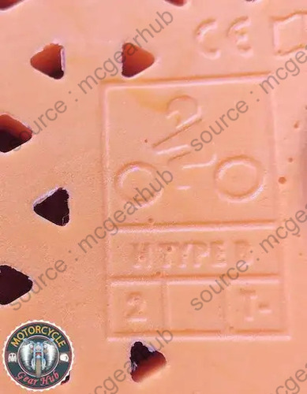
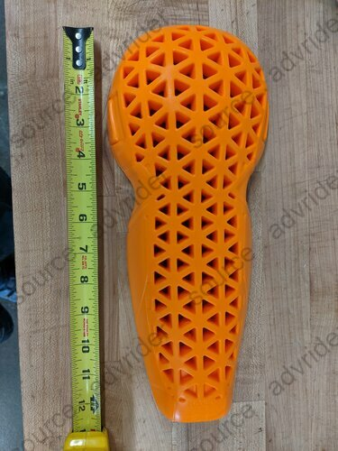
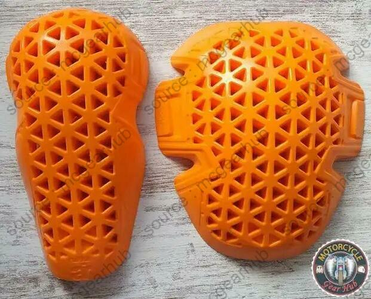
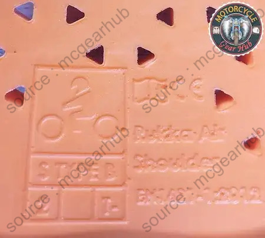
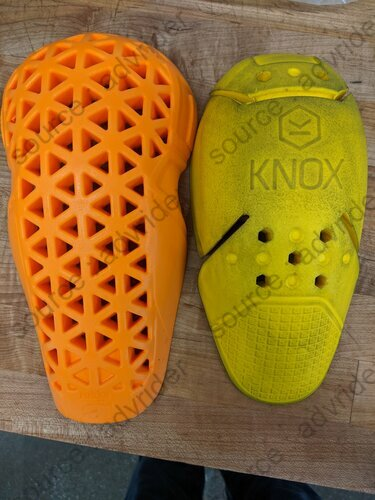

Cette fiche récapitule les informations que j'ai pu glaner sur le net sur les coques de protection _Rukka D3O Air XTR_ de niveau 2 (membres uniquement, je ne me penche pas sur le thorax _D3O CP1/L1_ qui est niveau 1).

_Synthèse :_ Souples, grande couverture, très bonne aération, tarif élevé.

Commercialisation :
-------------------

4 modèles dans la série (chers : 40 à 50e par paire), tous niveau 2 :

- Coude B
    - Dimensions : 25 cm x 14 cm
    - Poids : ? g
- Hanche B
    - Dimensions : 20 cm x 17 cm
    - Poids : ? g
- Epaule B
    - Dimensions : 23 cm x 19 cm
    - Poids : ? g
- Genou B/jambe B 
    - Dimensions : 33 cm x 15 cm
    - Poids : ? g

Trouvables un peu partout sur le net.

Caractéristiques des coques :
-----------------------------

- Certification : Niveau 2 T- (non certifiées T+) [^1]
- Protection réelle : Le fabriquant annonce <16,5 kN (norme : 20 kN en moyenne, maximum 30 kN)
- Fabrication : Chine
- Longévité annoncée : ?
- Type de matériaux : D3O, souple mais ne s'ajuste pas avec la chaleur corporelle
- Aération : Très bonne

Confort et comparaison avec les autres marques : 
------------------------------------------------

Mon avis :
La couverture est très bonne, la protection aussi, mais le prix est vraiment très élevé. C'est d'autant plus gênant que la production est en Chine alors que beaucoup d'autres équipementiers fabriquent en Europe et pour moins cher.

Pour des protections moins aérées mais plus protectrices (<12 kN), encore plus couvrantes et 2 à 3 fois moins chères, il est intéressant de regarder du côté de SAS-TEC :

- Genoux/coudes très grand format : [Mon article sur les SAS-TEC SC1/06EVO]()
- Epaules, genoux, coudes grand format : [Mon article sur les SAS-TEC SC1/EVO1, EVO2 et EVO3]()

### Retours d'expérience : Comparaison du D3O avec les Knox Micro-lock L2 :

> The softest high protection (CE2) armor I've found is the Knox MicroLock. It's more pliable then Forcefield, SasTec, or D3O; and has a softer feel when joint pressure is applied. 
> — <cite>[advrider cblais19](https://advrider.com/f/threads/comfortable-knee-armor.1371777/#post-37833963)</cite>

### Retours d'expérience : Comparaison du D3O avec les Forcefield Isolator 2 :

> "Compared to D3O’s [T5 EVO Pro X armor](https://www.mcgearhub.com/motorcycle-armor/d3o-knee-elbow-armor-review-t5-evo-pro-x/) (which is also CE-certified as Level 2), the Forcefield Isolator 2 armor is signicantly more contouring, wrapping and compliant."
> — <cite>[mcgearhub.com](https://www.mcgearhub.com/motorcycle-armor/forcefield-isolator-2-armor-review-all-pads/)</cite>

> "And Brian Van also said: "Forcefield is better [than D30] for sure. D3O is a nice low profile armor that helps to reduce bulk and increase comfort. You will find the Forcefield to be thicker as compared to the D3O which I feel is necessary to provide a higher level of protection."
> — <cite>[advrider Valentino](https://advrider.com/f/threads/ce2-replacement-armor-database-comparison.1466522/page-4#post-40897652)</cite>

Photos :
--------

Note : La plupart des photos viennent de la conversation [advrider.com : CE2 Replacement Armor Database / Comparison](https://advrider.com/f/threads/ce2-replacement-armor-database-comparison.1466522/) ou de [mcgearhub.com - Rukka D3O Air XTR Armor Review (CE Level 2 Protectors)](https://www.mcgearhub.com/motorcycle-armor/rukka-d3o-air-xtr-armor-review-ce-level-2-protectors/).

### Fiches constructeur :

### Photos générales :

Coudes :

Hanches :

Genou/Jambe :

Coude et épaule :

Epaule :

### Comparaisons :

#### Knox Micro-lock :

#### D3O T5 Evo :

Lectures :
----------

- [advrider.com : CE2 Replacement Armor Database / Comparison](https://advrider.com/f/threads/ce2-replacement-armor-database-comparison.1466522/)
- [Revzilla sur youtube - Rukka D3O Air XTR Replacement Armor Review](https://www.youtube.com/watch?v=UOx3L0t3X0M)
- [mcgearhub.com - Rukka D3O Air XTR Armor Review (CE Level 2 Protectors)](https://www.mcgearhub.com/motorcycle-armor/rukka-d3o-air-xtr-armor-review-ce-level-2-protectors/)

[^1]: Norme CE EN 1621-1 (protections épaules, hanches, membres) : Un poids de 5 kg est lâché avec une force de 50 joules sur la pièce, 9 fois. 
Niveau 1 : Moyenne <35 kN. Aucun choc ne dépasse 50 kN. 
Niveau 2 : Moyenne <20 kN. Aucun choc ne dépasse 30 kN. 
T+ : La protection reste la même jusqu'à 40°C. 
T- : La protection reste la même jusqu'à -10°C.