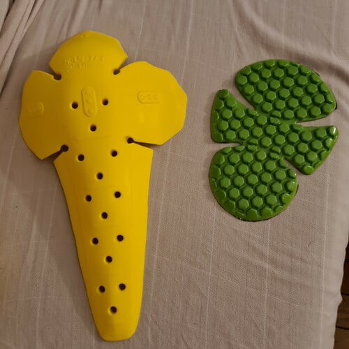
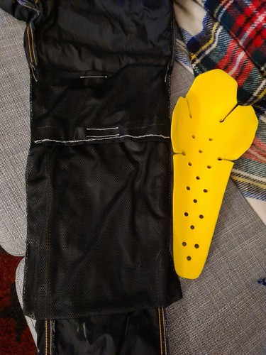
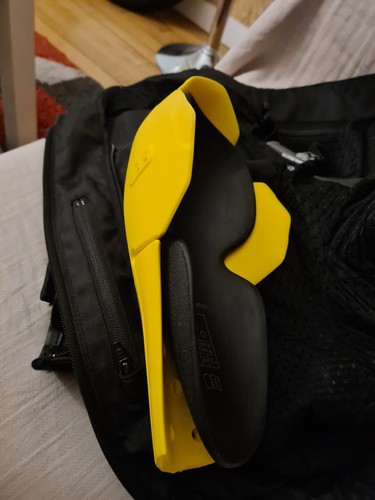

Cette fiche récapitule les informations disponibles sur le net sur les coques de protection _SAS-TEC SC1/06EVO_ de niveau 2, je possède ce modèle que j'utilise en protections genoux et coudes, les photos de l'article sont de moi.

_Synthèse :_ Protection excellente (40% au dessus de la norme) et énorme couverture des articulations (voir dimensions et photos plus bas), poids faible, aération correcte, et tarif raisonnable.

Commercialisation :
-------------------

1 modèle, vendu autour de 18e :

- SC-1/06EVO (Coude B/Genou B)
    - Dimensions : 41,5 cm x 26 cm x 1,6 cm
    - Poids : 145 g

Disponibles sur [fc-moto.de](https://www.fc-moto.de/fr/SAS-Tec-SC-1/06evo-Protecteurs-DEllbow/Knee).

Caractéristiques des coques :
-----------------------------

- Certification : Niveau 2 (non certifiées T+/T-) [^1]
- Protection réelle : Le fabricant annonce une majorité < 12 kN (norme : 20 kN en moyenne, maximum 30 kN) + une résistance à l'échauffement de son matériaux allant jusqu'à 100°C.
- Fabrication : ?
- Longévité annoncée : 10 ans
- Type de matériaux : Visco-élastique souple, s'ajuste avec la chaleur corporelle
- Aération : Bonne

Fiches constructeur :

- [SAS-TEC SC-1/06EVO](https://www.sas-tec.de/en/products/sc-1-06evo-new/)

Source pour la longévité et la température :

- [SAS-TEC about-us material](https://www.sas-tec.de/en/about-us/material/)

Mon expérience du confort, des alternatives et de l'intégration dans les vêtements moto :
------------------------------------------------------------------------------------------

Le matériaux est confortable et souple, s'ajuste rapidement à la température corporelle, et ne tient pas chaud.
Mon ressenti est que la souplesse, la texture et l'ajustement sont supérieurs au D3O.

Ces protections enveloppent complètement les articulations et pourtant elles gênent très peu, c'est assez impressionnant.

**Alternatives :**

Mes recherches n'ont pas trouvé beaucoup de protections comparables : 

- Il y a celles de BMW  : Pas mal de photos dans l'excellent article [Protéger ses os et ses articulations](https://afmb.fr/proteger-ses-os-et-ses-articulations/) de l'association AFMB -> !!! ATTENTION - l'article comporte des photos de blessures !!! ;
- Rukka fait une genouillère imposante en D3O (évoquée ici : [Mon récap sur les protections Rukka D3O Air XTR]()) mais elle est beaucoup plus chère et le D3O est moins confortable ;
- Rev'It fait une SeeFlex RV12 mais elle est plus courte et les avis la disent peu confortable (dure et bords piquants/coupants) (évoquée ici : [Mon récap sur les protections Rev'It SeeFlex]())  ;
- Held commercialise un modèle Quatrotempi vert, qui semble être une marque blanche de l'ancien modèle SAS-TEC SC1/06.

**Mes intégrations jean/blouson :**

**Genoux :**

A l'époque où j'ai acheté ces coques, je cherchais à disposer d'un jean un peu rassurant pour mes trajets occasionnels sur voie rapide.

Les jeans moto du marché me conviennent rarement (1m71, 85kg d'embonpoint) : Soit c'est la coupe qui ne ressemble à rien (jambes parachute, taille haute, etc.), soit ce sont les coques qui sont mal placées/trop petites pour s'interposer en cas de vraie chute.
Globalement la plupart de ces jeans n'ont pas des protections très couvrantes.

2 exceptions : 

- Les vêtements BMW, mais ils ne sont pas vraiment discrets et sont assez difficiles à trouver/essayer ;
- Certains jeans Broger semblent comporter cette coque de série, ex : [Fiche du jean Broger Ohio chez Sasie Center](https://www.sasiecenter.com/produit/jean-broger-kevlar-ohio-bleu/) (A noter : Je ne retrouve pas cette info sur le [site de la marque Broger](https://brogermoto.com/collections/motorcycle-jeans)).

J'ai donc pris un _DXR Howell City CE_ (Motoblouz) [^2], dont la coupe générale me convenait, j'ai cherché les coques les plus couvrantes disponibles, et j'ai cousu de nouvelles poches.

Comparaison avec les coques d'origine (_ESquad Hilon_ niveau 1) :

Création de poche en mesh ([polyester 50g](https://www.extremtextil.de/en/netting-polyester-elastic-50g-sqm.html) + [bandes](https://www.extremtextil.de/en/hooktape-for-sewing-016mm.html) [velcros](https://www.extremtextil.de/en/looptape-for-sewing-016mm.html) achetés pour quelques euros chez _extremtextil.de_) :

(Les poches semblent très grandes, mais comme les protections sont larges et enveloppantes, elles n'ont pas besoin d'être trop maintenues, elles restent naturellement en place)

Après plusieurs ports (dont 2 jours d'affilée parce que j'avais oublié de prendre un pantalon de rechange !), je peux dire que les coques sont présentes mais se font beaucoup oublier.

La seule gène que j'ai ressenti était lors de l'enfilage de mes bottes : La protection descend tellement bas qu'elle empêche de relever le bas du pantalon pour fermer les bottes.

**Coudes :**

En plus du pantalon, j'ai intégré ces coques comme protection coude dans un blouson : En largeur elles rentraient dans la poche sans forcer, j'ai réduit un peu la longueur pour qu'elles s'arrêtent quelques cm avant mon poignet.

Découpage :

Lectures :
----------

- [Motorcycle Gear Hub - SAS-TEC Armor Review: SC-1/06 Motorcycle Protectors](https://www.mcgearhub.com/motorcycle-armor/sas-tec-armor-review-sc-1-06-protectors/)

[^1]: Norme CE EN 1621-1 (protections épaules, hanches, membres) : Un poids de 5 kg est lâché avec une force de 50 joules sur la pièce, 9 fois. 
Niveau 1 : Moyenne <35 kN. Aucun choc ne dépasse 50 kN. 
Niveau 2 : Moyenne <20 kN. Aucun choc ne dépasse 30 kN. 
T+ : La protection reste la même jusqu'à 40°C. 
T- : La protection reste la même jusqu'à -10°C.

[^2]: La protection "niveau urbain" de ce jean est faible, depuis j'ai testé un jean chez xlmoto qui me convient aussi et est homologué AA : [Mon retour d'expérience sur le Course Rocker]().
