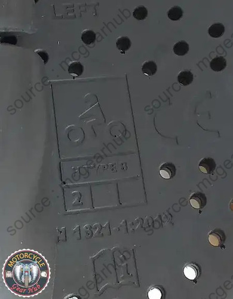

Cette série de fiches a pour objet de mémoriser/partager les infos que je trouve sur les coques de protection disponibles sur le marché.

Cette fiche récapitule les informations que j'ai pu glaner sur le net sur les coques de protection de hanches _Alpinestars Nucleon Racing KR-HR et Nucleon KR-H_ de niveau 1 et 2.

_Synthèse :_ Grande couverture, aération correcte, tarif élevé.

Commercialisation :
-------------------

4 modèles commercialisés à environ 30e les niveau 1, 40e les niveau 2 :

- Nucleon Racing HR-KR (niveau 2)
    - Hanche B
        - Dimensions : 22 cm x 16 cm
        - Poids : ? g
    - Hanche A
        - Dimensions : ? cm x ? cm
        - Poids : ? g
- Nucleon HR-K (niveau 1) 
    - Hanche B
        - Dimensions : 22 cm x 16 cm
        - Poids : ? g
    - Hanche A
        - Dimensions : ? cm x ? cm
        - Poids : ? g

Trouvables un peu partout sur le net.

Caractéristiques des coques :
-----------------------------

- Certification : 
    - Nucleon Racing KR-HR : Niveau 2 (non certifiées T+/T-) [^1]
    - Nucleon KR-H : Niveau 1 (non certifiées T+/T-) [^1]
- Protection réelle : ?
- Fabrication : ?
- Longévité annoncée : ?
- Type de matériaux : Visco-élastique souple, s'ajuste avec la chaleur corporelle
- Aération : Bonne

Note sur l'intégration dans les pantalons (source plus bas) :

- Protections de hanche en C de forme et taille standards, elles rentreront dans les poches prévues pour (source : [Motorcycle Gear Hub](https://www.mcgearhub.com/motorcycle-armor/alpinestars-nucleon-racing-kr-hr-hip-protectors-review/)) ;
- Protections fournies avec des poches en tissu pouvant être intégrées dans les pantalons ;
- Protections et poches équipées de velcros (mais il vaut mieux coudre les poches au pantalon) ;

**Idée : Utilisation comme protection thoracique :**

Motorcycle Gear Hub indique que la taille et la forme permettent de les utiliser comme protections thoracique, exemple ici : [AGV Sport Willow leather jacket - mcgearhub.com](https://www.mcgearhub.com/motorcycle-jackets/agv-sport-willow-leather-jacket-review-problems-solutions-improvements/)

Confort et comparaison avec les autres marques : 
------------------------------------------------

#### Retours d'expérience : Compatibilité avec les poches existantes :

> The dimensions of the Large-sized pads are [...] on point with the universal dimension of the biggest hip pads around (for motorcyclists) and that are also commercialized by the likes of [Rev’It](https://www.mcgearhub.com/motorcycle-pants/revit-tornado-2-pants-review/), [D3O](https://www.mcgearhub.com/tag/d3o-armor/) and Oxford. 
> Furthermore, you will find many motorcycle jeans using Level-1 CE-rated generic hip armor that meets these same dimensions
> — <cite>[Motorcycle Gear Hub](https://www.mcgearhub.com/motorcycle-armor/alpinestars-nucleon-racing-kr-hr-hip-protectors-review/)

### Retours d'expérience : Coudre les poches dans son pantalon :

> We still recommend that you stitch the pockets (with two rows of threading) into the
inside liner of your pant or jacket for further peace of mind.
> — <cite>[Motorcycle Gear Hub](https://www.mcgearhub.com/motorcycle-armor/alpinestars-nucleon-racing-kr-hr-hip-protectors-review/)

### Retours d'expérience : Utilisation comme protection thoracique :

> Incidentally, the KR-HR protectors can also be used as chest armor as I’ve done with an [AGV Sport Willow leather jacket](https://www.mcgearhub.com/motorcycle-jackets/agv-sport-willow-leather-jacket-review-problems-solutions-improvements/)
> — <cite>[Motorcycle Gear Hub](https://www.mcgearhub.com/motorcycle-armor/alpinestars-nucleon-racing-kr-hr-hip-protectors-review/)

Photos :
--------

### Fiches constructeur :

### Photos générales :

Lectures :
----------

- Vidéo Revzilla : [Alpinestars Nucleon KR Hip Protectors Review at RevZilla.com (2017)](https://www.youtube.com/watch?v=MM0XZrtIrVU)
- Vidéo McGearHub : [Alpinestars KR-HR Hip Protectors Armor Review (Nucleon Level 2) (2017) ](https://www.youtube.com/watch?v=0-ig7TnyuNE)
- Article : [Alpinestars Nucleon KR-HR Hip Protectors Review - Motorcycle Gear Hub](https://www.mcgearhub.com/motorcycle-armor/alpinestars-nucleon-racing-kr-hr-hip-protectors-review/)

[^1]: Norme CE EN 1621-1 (protections épaules, hanches, membres) : Un poids de 5 kg est lâché avec une force de 50 joules sur la pièce, 9 fois. 
Niveau 1 : Moyenne <35 kN. Aucun choc ne dépasse 50 kN. 
Niveau 2 : Moyenne <20 kN. Aucun choc ne dépasse 30 kN. 
T+ : La protection reste la même jusqu'à 40°C. 
T- : La protection reste la même jusqu'à -10°C.
